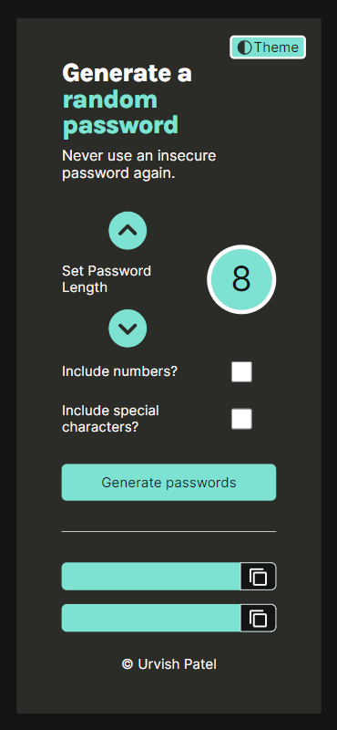

# Password Generator

Have you ever been in need of a password that requires all the criteria 
of a website? In this day and age, who hasn't? Well, here you are: a
password generator application that generates premium passwords by utilizing a randomizing algorithm. Once generated, you have the ability to copy the password and paste it wherever you want. Long gone are the days where you have to take a couple minutes to think of a good password as this password generator app does the work for you. And the best part is you can use this on your phone! So, utilize this wherever you want and enjoy.

## Table of contents

- [Overview](#overview)
  - [The challenge](#the-challenge)
  - [Screenshot](#screenshot)
  - [Links](#links)
- [My process](#my-process)
  - [Built with](#built-with)
  - [What I learned](#what-i-learned)
  - [Continued development](#continued-development)
  - [Useful resources](#useful-resources)
- [Author](#author)
- [Acknowledgments](#acknowledgments)

## Overview

This project is from the Scrimba Frontend Development bootcamp, made with MANY enhancements:

Requirements<br>
✅ Build it from "scratch" (using a Figma file)<br>
✅ Generate 2 random passwords when the user clicks the button<br>
✅ Each password should be 15 characters long

Stretch Goals<br>
✅ Ability to set password length<br>
✅ Add "copy-on-click" feature<br>
✅ Toggle "symbols" and "numbers" on/off

My Additions<br>
✅ Make responsive<br>
✅ Implement personal UI design for above stretch goals<br>
✅ Make usable on mobile devices<br>
✅ Use my own color palette<br>
✅ Make LIGHT/DARK/SYSTEM modes

### The challenge

Generate two random passwords upon clicking a button.

### Screenshot




### Links

Live Site: [https://premium-password.netlify.app/](https://premium-password.netlify.app/)

## My process

Completed the core requirements first: wrote the HTML, then the CSS, and finally the JS. For the stretch goals and my additions, worked piece-by-piece; that is, wrote the HTML for one goal/addition, then the CSS for it, and finally the JS for that goal/addition—repeated this process until all wanted features were included.

### Built with

This webapp was built with HTML, CSS, and JS.

### What I learned

There is a media query that allows for system theme detection.
```css
@media (prefers-color-scheme: dark) {}
@media (prefers-color-scheme: light) {}
```
When running a webpage on Firefox, the webpage's system theme is based on the browser's theme, not the Operating Systems' theme.

In order to make light/dark/system theme possible, CSS custom variables are necessary. Naming them adequately helps.

Additionally, when the color of interactive elements on the webpage are more pronounced/well contrasted from the background, the user will be more likely to click/notice them. Regarding UX, this makes the functionality of the webpage as obvious as possible. I, the developer, will be aware of all the functionalities of the webpage, but for a new user, they won't have any knowledge of what the website can do. So, the only indication of how the website can be used is through its (good) UI.

### Continued development

- [ ] Turn this project into a password diary that allows the user to store their password for each website they have an account with

### Useful resources

How to implement light/dark/system themes: [https://javascript.plainenglish.io/how-to-make-a-system-light-dark-theme-selector-4e70322205d7](https://javascript.plainenglish.io/how-to-make-a-system-light-dark-theme-selector-4e70322205d7)

## Author

GitHub is the only resource I have right now that's associated with me.

## Acknowledgments

My Mother and Uncle. I gave them this app to use to try to figure out if the UX/UI for this app is obvious, and their feedback informed me as to what alterations are necessary for the UX/UI.